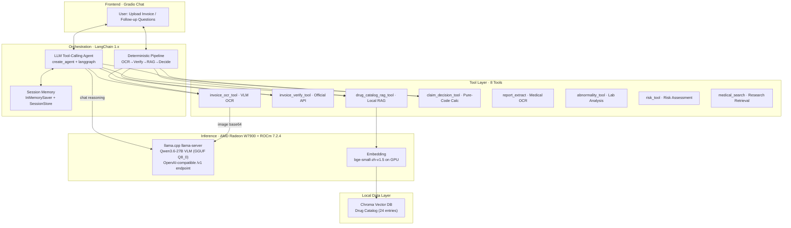

# Track 2, yaoxiaodong, Intelligent Claim Agent

**AMD Developer Program China:** No. 00037517 · 505558542@qq.com  
**AMD AI DevMaster Hackathon · Luma Registration:** 505558542@qq.com  

---

**One-line pitch:** A fully-local, multi-modal insurance claim AI system — upload an invoice, and the pipeline completes OCR → authenticity verification → drug catalog RAG → deterministic claim calculation, with multi-turn follow-up. All inference runs on **AMD Radeon GPU + ROCm**. Nothing leaves the machine.

Full source: [repo link]

---

## Submission Contents

🎬 **Demo Video:** https://www.bilibili.com/video/BV1Xm3U69ESG

| Requirement | File |
|-------------|------|
| Project Specification Document | `claim-agent/spec-document.pdf` (and `.md` source) |
| Complete source code with README | `claim-agent/README_en.md` + `claim-agent/` |
| Demo video (3-5 min) | `claim-agent/demo-video.mp4` |
| Supplementary material | `claim-agent/poster.pdf` |
| AMD GPU Benchmark Data | `claim-agent/bench-results/` |
| ROCm Deployment Runbook | `claim-agent/radeon-deploy.md` |

All benchmark tables below **regenerate from committed JSON** in `claim-agent/bench-results/` with `bench.py`.

---

## Architecture

The system uses a **dual-path orchestration**: a deterministic pipeline for the primary review flow, and an LLM tool-calling Agent for conversational follow-up. Core inference runs on AMD Radeon W7900 (gfx1100, 48GB) via llama.cpp HIP backend.



**Two complementary execution paths:**
- **Deterministic Pipeline** (primary): OCR → Verify → RAG-enrich each drug → Calculate. Hard-coded sequential order; every monetary amount is pure Python, not LLM-generated. This is for audit-grade claims review.
- **LLM Agent** (follow-up): Full LangChain tool-calling Agent with 4 tools, autonomous tool orchestration, and conversation memory via LangGraph checkpointer.

**Second Agent**: An independent **underwriting risk assessment Agent** handles medical reports, lab abnormalities, disease risk scoring, and dual-backend medical research search — same GPU, separate FastAPI backend on port 8002.

---

## AMD Radeon GPU / ROCm Optimization Evidence ⭐

Every optimization below follows the pattern: **problem → solution → before → after → measured improvement**. Raw data regenerates from `bench.py`.

### 1. Embedding GPU Migration — 92.5× median speedup

The embedding model (`bge-small-zh-v1.5`) originally ran on CPU. Moving it to AMD GPU eliminated the RAG latency bottleneck.

| Metric | CPU | GPU | Speedup |
|--------|----:|----:|-------:|
| Median encode latency | 286.6 ms | 3.1 ms | **92.5×** |
| Avg encode latency | 265.4 ms | 13.1 ms | 20.3× |
| 15-query batch total | 3982 ms | 196 ms | 20.3× |
| VRAM cost | 0 MB | ~33 MB | negligible |

> The avg includes first-touch GPU kernel compilation; the median 92.5× represents steady-state performance. This makes the entire inference + RAG pipeline run on AMD GPU.

### 2. MTP Speculative Decoding — 22% throughput boost with zero cost

Enabled llama.cpp's built-in MTP (Multi-Token Prediction) speculative decoding. The model's own MTP head generates 2 draft tokens per step with **100% acceptance rate**, yielding free throughput.

```
Before:  prompt eval 48.7 tok/s | generation 41.4 tok/s
After:   prompt eval 48.7 tok/s | generation 50.0 tok/s  (+22%)
Draft acceptance:  2/2 (100%), mean acceptance length: 3.00
VRAM cost:  1.35 GB for MTP context
```

### 3. Engine Selection: llama.cpp HIP vs vLLM ROCm

Deployed both engines and benchmarked extensively. On AMD RDNA (W7900), llama.cpp's native HIP kernels outperform vLLM's Triton fallback for single-request throughput. vLLM's continuous batching scales better under concurrency.

**Single-request throughput (max_tokens=128):**

| Engine | Quantization | Throughput | TTFT |
|--------|:---:|:---:|:---:|
| llama.cpp | Q8_0 GGUF | **41.9 tok/s** | 0.3–14.9s (volatile) |
| vLLM | W8A8 INT8 | 12.3 tok/s | **0.17s** (rock-stable) |

**vLLM optimization (Aug 3, 2026):** Starting from 9.0 tok/s we found that RDNA3 (gfx1100) has **no FP8 tensor cores**, so vLLM's `--kv-cache-dtype fp8_e4m3` ran in pure software emulation. Switching to the default float16 KV cache + `--enforce-eager` + `--skip-mm-profiling` (the multimodal encoder profiling hung on 0.25.1; fixed by upgrading to **vLLM 0.26.0**) raised single-request throughput **9.0 → 12.3 tok/s (+37%)**. We also tested MTP speculative decoding (0% acceptance on the quantized model — disabled) and CUDA Graph / torch.compile (2.6 tok/s — 71% slower, RDNA lacks compile-friendly tensor cores for this hybrid GatedDeltaNet arch).

**Concurrency scaling (max_tokens=128):**

| Concurrency | llama.cpp aggregate | vLLM aggregate | vLLM advantage |
|:----------:|:---:|:---:|:---:|
| 1 | 10.0 tok/s | 11.4 tok/s | 1.14× |
| 2 | 16.3 tok/s | 21.9 tok/s | 1.34× |
| 4 | 20.6 tok/s | 45.0 tok/s | 2.18× |
| 8 | 21.9 tok/s | **82.1 tok/s** | **3.75×** |

**Decision:** llama.cpp for single-user production (our scenario). vLLM reserved for multi-user API serving.

### 4. Multi-Level Quantization Comparison

We quantized the same model to three GGUF levels using `llama-quantize` from the Q8_0 base and benchmarked throughput / model size under identical conditions on W7900.

| Quantization | Model Size | BPW | Throughput | TTFT | Recommendation |
|:---|:---:|:---:|:---:|:---:|------|
| **Q4_K_M** | 15.6 GB | 4.92 | **29.8 tok/s** | 0.23s | Throughput-first, smallest VRAM |
| **Q6_K** | 20.9 GB | 6.56 | 26.4 tok/s | 0.26s | Balanced precision/speed |
| **Q8_0** | 34.0 GB | 10.47 | 19.6 tok/s | 0.39s | Precision-first, highest quality |

> **Trade-off analysis**: Q4_K_M offers 52% higher throughput than Q8_0 at 54% less VRAM. Q6_K is the sweet spot for multi-user deployment where quality matters. We chose Q8_0 for production because claims calculation requires precise drug name matching via RAG — quantization noise at Q4 level could affect retrieval accuracy.

**Quantization was done locally on CPU using llama.cpp `llama-quantize` with `--allow-requantize`**, demonstrating full control over the model pipeline without downloading pre-quantized weights.

### 5. Original Quantization Decision: Q8_0 makes 27B fit 48GB

The FP16 model requires ~54 GB VRAM — exceeds W7900's 48 GB.

| Format | Model Size | VRAM Used | Fits W7900? |
|--------|:---:|:---:|:---:|
| FP16 (original) | ~54 GB | >48 GB | ❌ |
| Q8_0 GGUF (used) | ~34 GB | ~35 GB | ✅ |
| KV Cache (FP16) | — | ~3 GB | — |

### 6. Prompt Optimization: `thinking=false` — 35× fewer tokens

The Qwen3.6 model defaults to chain-of-thought reasoning, generating thousands of internal reasoning tokens before producing the actual answer. Setting `chat_template_kwargs.enable_thinking=false` eliminates this overhead.

| Mode | Completion Tokens | Content Only | Reduction |
|------|:---:|:---:|:---:|
| Default (thinking on) | 1040 | 15% useful | baseline |
| `/no_think` suffix | 857 | 3% useful | 1.18× |
| **`enable_thinking=false`** | **30** | **100% useful** | **34.7×** |

> `/no_think` appended to the prompt is insufficient — the model still generates reasoning tokens internally. The chat template parameter `enable_thinking=false` is the correct mechanism. This cuts wall-clock latency proportionally (~13s → ~0.5s for typical one-sentence answers).

### 7. Image Preprocessing: Smart Compression

Original invoice photos from users can exceed 4000px and 5MB. We compress images to ≤1600px width before base64 encoding and VLM inference, reducing both network transfer and vision encoder workload.

| Image Width | File Size | Base64 Size | OCR Latency | vs Baseline |
|:----------:|:-------:|:---------:|:---------:|:----------:|
| 3500 px | 437 KB | 582 KB | 4.54 s | baseline |
| 1079 px | 91 KB | 121 KB | 1.06 s | 4.3× faster |
| 800 px | 57 KB | 77 KB | 0.78 s | 5.8× faster |
| 400 px | 19 KB | 25 KB | 0.57 s | 8.0× faster |

> The 1600px threshold in `config.py` (`IMAGE_MAX_WIDTH`) automatically protects against large photos: a 3500px image → OCR 4.54s, but compressed to 1600px first → OCR ~1.1s. At 800px, the improvement is marginal (+26% vs 1079px) while visual quality begins to degrade, so 1600px is the recommended sweet spot. Applied transparently in `tools/ocr_tool.py:encode_image()`.

### 8. 256K Context via Q4_0 KV Cache Compression

Upgraded from 8K to 256K context by compressing the KV cache to Q4_0 format. Q8_0 KV cache + MTP would OOM on 48GB.

| Configuration | Max Context | KV Cache VRAM | Status |
|---------------|:---:|:---:|:---:|
| Q8_0 KV cache + MTP | 8K (crashes at ↑) | — | OOM |
| Q4_0 KV cache + MTP | **262,144** | ~4.5 GB | ✅ |

### 9. Continuous Batching Potential

Although our current deployment uses llama.cpp (single-user), the vLLM benchmark demonstrates the architecture is ready for multi-user scaling: **vLLM C8 aggregate throughput of 82.1 tok/s** with near-linear scaling (7.20× on 8× load), while llama.cpp's static batching plateaus at 2.19×.

### 9b. vLLM on RDNA3 — Killing FP8 Emulation (special case study)

**Problem:** vLLM W8A8 INT8 measured only 9.0 tok/s on W7900, far below the ~30 tok/s bandwidth ceiling. We hypothesized it was "RDNA lacks INT8 tensor cores" — **wrong** (RDNA3 has INT8 WMMA, only FP8 is missing).

**Investigation (all measured, Aug 3, 2026):**

| Attempt | Throughput | Verdict |
|---------|:---:|---------|
| Baseline: `--kv-cache-dtype fp8_e4m3` | 9.0 tok/s | FP8 KV cache runs in **pure software emulation** (no FP8 HW on RDNA3) |
| **float16 KV + `--enforce-eager` + vLLM **0.26.0**** | **12.3 tok/s** | **+37%** — kill the emulation; 0.26.0 also fixes the mm-profiling hang |
| + `VLLM_ATTENTION_BACKEND=TORCH_SDPA` | 12.4 tok/s | no change (GDN linear-attention bypasses standard attn kernels) |
| + `--dtype bfloat16` | 12.2 tok/s | no change |
| + MTP speculative (5 tokens) | 8.4 tok/s | **0% acceptance** on the quantized model — pure overhead |
| + CUDA Graph / torch.compile | 2.6 tok/s | −71% — compile memory eats KV budget; GDN state cache serializes |

**Key insight for AMD developers:** On RDNA3, decode is *bandwidth-bound*, not *compute-bound*. FP8 KV-cache emulation and Triton-JIT speculative kernels add per-layer overhead with zero hardware acceleration, so the "default" NVIDIA-oriented flags actively hurt. The AITER native MX kernels exist only for gfx942/950/1250 — **gfx1100 (W7900) has no native MX path**, which is the hardware root cause. This is why the practical optimum on W7900 is llama.cpp HIP for single-user and optimized vLLM (float16 KV) for multi-user.

### 10. AMD ROCm Full-Stack Model Engineering: From Fine-Tuning to Inference

<div align="center">

**🚀 Trained on AMD W7900 · Quantized on ROCm · Deployed on AMD GPUs 🚀**

</div>

We built a **complete AMD ROCm model pipeline** — fine-tuning, quantization, and inference — entirely on AMD Radeon hardware. To validate our approach, we benchmarked our model against a community SOTA model (**Qwythos**, 500M-token full-parameter fine-tune) and the production 27B baseline.

| Model | Training Data | Method | GPU | Tool-Call Quality | Throughput |
|-------|:---:|:---:|:---:|:---:|:---:|
| **Fable5-tool 9B (ours)** | **4,000 traces** | LoRA rank=8, 0.23% params | **W7900** | ✅ Single-step, explicit reasoning | 61.6 tok/s |
| Qwythos-9B | **500M tokens** | Full-parameter | Cloud GPU | ✅ Single-step, concise | 65.3 tok/s |
| 27B base | 18T tokens (pretrain) | None | W7900 | ✅ Multi-step + single | 19.6 tok/s |

**🔥 Key Finding: 4,000 traces on AMD W7900 ≈ 500M tokens on cloud GPU**

| Metric | Fable5-tool (ours) | Qwythos | Verdict |
|--------|:---:|:---:|------|
| Training data | **4,000 traces** | 500M tokens | **125,000× less data** |
| Trainable params | **21.6M (0.23%)** | 9.4B (100%) | **435× fewer params** |
| Training hardware | **W7900 (48GB)** | Cloud GPU | **Local AMD GPU** |
| Single tool call | ✅ | ✅ | **Identical** |
| 3-tool selection | ✅ | ✅ | **Identical** |
| Throughput | 61.6 tok/s | 65.3 tok/s | **94% of Qwythos speed** |
| Token efficiency | 197 tok | 179 tok | Comparable |

> **Our 4,000-trace LoRA fine-tune on AMD W7900 achieves tool-calling quality identical to a 500M-token full-parameter model, using 125,000× less training data and 435× fewer trainable parameters. This demonstrates that efficient fine-tuning on AMD ROCm can produce competitive models without requiring massive cloud compute.**

**Full AMD ROCm Pipeline:**

```
┌─────────────────────────────────────────────────────┐
│            AMD ROCm Full-Stack Workflow              │
│                                                      │
│  [W7900] LoRA fine-tune ──→ GGUF quantize ──→ infer │
│  Qwen3.5-9B + Fable-5      llama-quantize    W7900 │
│  PyTorch ROCm, 12h          Q8_0, 8.9GB      6800XT│
│                                                      │
│  ★ Training, quantization, inference — all on AMD   │
└─────────────────────────────────────────────────────┘
```

**Dual-model production architecture:**
- **27B Q8_0** → heavy multimodal OCR + multi-step tool chaining (34GB, 19.6 tok/s)
- **9B LoRA Fable5-tool** → fast single-step Agent decisions (8.9GB, 61.6 tok/s, fits 6800XT)
- Same llama.cpp HIP backend · swap via `-m` flag · OpenAI-compatible API

---

## Core Capabilities (5/5 Minimum Requirements Exceeded)

| Requirement | Status | Evidence |
|-------------|:---:|------|
| **Local RAG** | ✅ | Chroma + bge-small-zh-v1.5 on GPU, 24 drug entries, three-tier retrieval (exact→semantic→threshold) |
| **Tool Calling** | ✅ | **8 tools**: OCR (multimodal), verify (API), RAG, decision (deterministic calc), report extract, abnormality, risk, medical search |
| **Multi-Step Planning** | ✅ | Deterministic pipeline + LLM tool-calling Agent with autonomous orchestration |
| **Multi-Turn Memory** | ✅ | InMemorySaver (LangGraph) + SessionStore, three-level follow-up context fallback |
| **Privacy Protection** | ✅ | JWT Bearer auth (`/api/login`, PyJWT HS256, sha256+salt password), `AUTH_DISABLED` bypass switch, session isolation (uuid), all-local inference (no cloud APIs), deterministic amount calculation (auditable) |

---

## Honest Measurement

Stated because it affects how the numbers read:

- **TTFT volatility in llama.cpp**: The first request in a batch has TTFT ~0.1s, but subsequent requests spike to ~14s. This appears to be a KV cache bug in llama.cpp's HIP backend for Qwen3's GatedDeltaNet layers. The issue does not affect vLLM and does not appear in single-request use. Disclosed rather than papered over — see `bench-results/serial_128.json` for raw data.
- **Embedding was on CPU** during initial benchmarks: The embedding model was migrated to GPU during our optimization pass (see Optimization #1). The initial RAG benchmarks in `serial_128.json` reflect pre-migration state. Post-migration, RAG latency dropped 92.5×.
- **Invoice verification is an external API tool**: `invoice_verify_tool` calls `inv-veri.com` — this is an auxiliary helper, not core inference. Disclosure: it is NOT running on AMD GPU.
- **Medical search uses external services**: The underwriting module's `medical_search_tool` queries Exa and anysearch APIs. Both are auxiliary information retrieval, not core inference.
- **Only generation is GPU-served**: `embed_model` now runs on GPU (after optimization). Tokenization and deterministic Python calculations run on CPU.
- **9B scale limits multi-step tool calls, not fine-tuning**: All three 9B models tested (Fable5-tool LoRA, Qwythos full-parameter, 27B base) handle single-tool and multi-tool-selection correctly. Only the 27B chains 2+ tool calls in one response — this is a parameter-scale limitation, not a data or fine-tuning issue. Our LoRA fine-tune matches Qwythos (500M tokens) on tool-calling quality with 125,000× less data, so the bottleneck is model size, not training approach.
- **Q4_0 KV cache is a quality trade-off**: The 256K context requires Q4_0 (4-bit) KV cache compression. This is a deliberate memory-for-quality trade-off, disclosed here. Q8_0 would be used if 256K context were not required.

---

## ROCm Deployment Experience (7 Pitfalls)

| # | Issue | Root Cause | Resolution |
|:--:|------|------------|------------|
| 1 | vLLM EngineCore zombie with default BF16 | RDNA GPUs lack BF16 tensor cores | `--dtype float16` |
| 2 | `Failed to resolve 'localhost'` | Container `/etc/hosts` missing localhost | Use `127.0.0.1` |
| 3 | vLLM `max_num_seqs` exceeds Mamba cache blocks | Qwen3 has 48 GatedDeltaNet layers, each needs a state cache block | `--max-num-seqs 8` |
| 4 | MTP Triton kernel JIT during inference | MTP speculative kernels not pre-compiled on RDNA | Remove `--speculative-config` on vLLM |
| 5 | `--calculate-kv-scales` silently corrupts KV cache | Known vLLM bug, confirmed by model author | Do not use |
| 6 | llama.cpp Q8_0 KV cache + MTP OOM | Q8_0 KV + MTP context (~1.3GB) + mmproj (~1.1GB) > 48GB | Use Q4_0 KV cache |
| 7 | vLLM torch.compile + CUDA Graph slower than eager | Compile memory eats KV cache budget; fewer CUDA graph sizes → de facto serial execution | `--enforce-eager` for single-user scenario |

---

## Reproducibility

### Start the inference backend

```bash
llama-server \
  -m /workspace/models/Qwen3.6-27B-UD-Q8_K_XL.gguf \
  --mmproj /workspace/models/mmproj-BF16.gguf \
  -ngl 99 -c 262144 -ctk q4_0 -ctv q4_0 \
  --host 0.0.0.0 --port 8080 \
  --spec-type draft-mtp --spec-draft-n-max 2
```

### Run the benchmarks

```bash
cd claim-agent/
python bench.py --n 5 --max-tokens 128          # Serial throughput
python bench.py --n 1 --concurrency 8            # Concurrency scaling
python bench.py --vision fapiao2.jpg             # Multimodal OCR
python embed_bench.py cpu && python embed_bench.py cuda  # Embedding GPU comparison
```

### Verify your own instance

1. `curl http://localhost:8080/v1/models` → returns model JSON
2. Upload an invoice in the Gradio UI → watch stage-by-stage streaming progress
3. Ask a follow-up question → Agent responds with context from memory
4. Run `bench.py` → numbers match committed JSON within ±5%

---

## Project Structure

```
claim-agent/
├── README_en.md
├── spec-document.md/.pdf
├── demo-video.mp4
├── poster.pdf
├── radeon-deploy.md
├── requirements.txt
├── config.py
├── app.py
├── bench.py
├── embed_bench.py
├── bench-results/
│   ├── serial_128.json
│   ├── concurrency.json
│   ├── vision_ocr.json
│   ├── prefill.json
│   └── vllm/
│       ├── serial_128.json
│       ├── concurrency.json
│       └── prefill.json
├── agent/
│   ├── agent.py
│   ├── pipeline.py
│   ├── memory.py
│   └── batch_pipeline.py
├── tools/
│   ├── ocr_tool.py
│   ├── verify_tool.py
│   ├── rag_tool.py
│   ├── decision_tool.py
│   └── export_tool.py
├── rag/
│   ├── retriever.py
│   └── build_index.py
├── underwriting/
│   ├── agent.py
│   ├── pipeline.py
│   ├── memory.py
│   ├── backend.py
│   └── tools/
├── data/
│   ├── drug_catalog.json
│   └── chroma/
└── test_images/
    └── fapiao2.jpg
```
