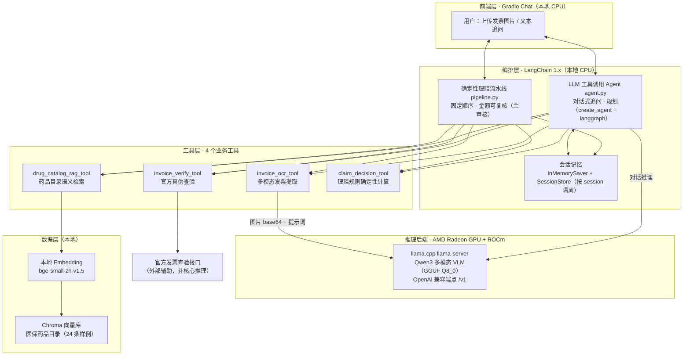

# 智能理赔 Agent 系统 — 项目说明文档

> AMD Radeon GPU 黑客松 · 赛道二（本地化 AI Agent 应用）
>
> 一句话简介：**上传一张发票，系统自动完成「多模态识别 → 真伪查验 → 医保药品目录检索 → 理赔金额计算」，并支持多轮追问**。核心大模型推理运行在 **AMD Radeon GPU + ROCm** 上。

---

## 一、应用场景

保险理赔、医保报销、企业医疗费用核销等场景，每天都要人工处理大量发票：**看图录入 → 核验真假 → 判断药品是否在报销目录 → 按甲/乙类规则算钱**。这套流程重复、易错、且对隐私敏感（发票含个人与就诊信息，不宜上传第三方云）。

本项目面向以下典型场景：

| 场景 | 痛点 | 本系统价值 |
|------|------|-----------|
| **保险公司理赔初审** | 人工录入 + 逐条查目录，效率低、口径不一 | 秒级出结构化结论，金额规则可复核 |
| **医保报销代办 / 企业报销** | 需判断药品甲/乙类、自付比例、封顶线 | 内置目录检索 + 确定性规则计算 |
| **发票真伪核查** | 假发票、票面信息篡改 | 对接官方查验接口，字段逐项比对 |
| **理赔客服问答** | 用户反复追问「为什么这项不报」「按乙类算多少」 | 多轮对话记忆，基于本次结论即时解释 |

**关键约束——数据不出域**：整套系统可**完全本地化部署**，大模型推理跑在本地 AMD Radeon GPU 上，向量检索与规则计算跑在本地 CPU，不依赖任何远程大模型 API，满足医疗/金融数据的隐私合规要求。

---

## 二、Agent 架构图

系统采用**「LLM 编排 + 确定性工具」**的分层架构：大模型只负责理解、规划与解释，所有涉及金额的计算都交给纯 Python 工具，保证结果可复核、不被模型「算错数」。



**数据流（上传发票 → 结论）：**

1. 用户在 Gradio 界面上传发票图片并发送；
2. `invoice_ocr_tool` 调用 AMD 上的多模态模型，提取发票代码/号码/日期/价税合计 + **药品明细列表**；
3. `invoice_verify_tool` 调官方接口核验真伪，**不通过则短路直接拒赔**；
4. 对每一项药品，`drug_catalog_rag_tool` 在本地向量库检索目录（甲/乙类、报销比例、自付、封顶、是否商保创新药）；
5. `claim_decision_tool` 按三层规则**确定性计算**可报销金额与结论；
6. 前端流式展示每个阶段进度 + 右侧「理赔结论卡片」（总额/可报/逐项）；
7. 结果写入会话记忆，用户可继续追问，系统基于本次结论即时解释，无需重复识别。

**两条互补路径：**

- **确定性流水线（主审核）**：代码固定顺序推进，金额链路全程可复核，前端主审核动作用它，稳定可靠；
- **LLM Agent（对话追问）**：真正的 tool-calling Agent，负责多轮对话、规划与解释，体现「任务分解 + 工具调用 + RAG + 记忆」。

---

## 三、核心能力介绍

### 3.1 多模态发票识别
基于视觉大模型直接「看图」提取结构化字段与药品明细，无需传统 OCR 模板。对图片先做等比压缩（≤1600px）再编码，降低视觉编码耗时；提示词强约束只返回 JSON，并对思维链模型做 `<think>` 段剥离、`content`/`reasoning_content` 三重兜底解析，保证 JSON 稳定可解析。

### 3.2 官方真伪查验
对接官方发票查验接口，将返回结构化为 `official`（销方/购方/金额/税额/开票日期）与 `field_match`（发票号、价税合计逐项比对），多编码（utf-8/gbk/gb18030）自适应解码。查验不通过即短路拒赔。

### 3.3 RAG 药品目录检索（三级策略）
医保药品目录离线构建为 Chroma 向量库（余弦空间），检索分三层：
1. **精确/模糊名称匹配**（规范化去规格剂量后比对通用名/商品名），命中即高置信返回；
2. **语义召回**：本地 bge embedding 向量检索 Top-K；
3. **阈值判定**：最高相似度 < 0.6 且非商保创新药 → 判为**目录外**。

> 该阈值机制确保「非医保商品」（如把生活用品发票误传）不会被错误匹配到某个药品，直接判目录外、不予报销。

### 3.4 确定性理赔决策（三层规则，纯代码）
金额计算完全由 Python 工具完成，**不经过大模型**，保证准确可复核：
- **商保创新药**：医保不报，商保按约定比例报销；
- **甲类**：全额纳入基数，按统筹比例报销；
- **乙类**：先行自付（自付二）后，再按统筹比例报销；
- **目录外**：不予报销。
- 封顶线作用于医保可报部分；发票真伪未通过则整张拒赔。
- 汇总输出结论：**全额通过 / 部分通过 / 拒赔**，并识别「整张均目录外」的疑似非医疗发票场景。

### 3.5 多轮对话与记忆
- LLM Agent 用 langgraph `InMemorySaver` 按 `thread_id`(=session) 隔离对话历史；
- 另有 `SessionStore` 保存每个会话「上一张发票的结构化理赔结果」；
- 追问（如「为什么这项被拒」「按乙类重算多少」）直接引用已算好的结构化结果作答，**不重复识别与查验**，快且省算力。

### 3.6 对话式前端
Gradio 5 Chat 界面：图片上传 + 文本提问 + 逐阶段流式进度（🔍识别→🛡️查验→📚检索→🧮计算）+ 右侧结论卡片（结论色块 / 金额汇总表 / 逐项明细表）+ 多轮会话隔离 + 启动预热（提前加载 embedding 模型，消除首次冷启动卡顿）。

---

## 四、模型介绍与本地部署方案

### 4.1 模型选型

| 用途 | 模型 | 说明 |
|------|------|------|
| **主推理（多模态 VLM）** | Qwen3 系列多模态大模型，`Qwen3.6-27B-Q8_0.gguf` | 视觉理解 + 中文能力强；GGUF **Q8_0 量化**，兼顾精度与显存/吞吐；支持 OpenAI 工具调用协议 |
| **文本向量化（Embedding）** | `BAAI/bge-small-zh-v1.5` | 中文检索型 embedding，本地 sentence-transformers 加载，体积小、CPU 即可跑 |

### 4.2 推理后端部署（AMD Radeon GPU + ROCm）

**实际运行环境：**

| 项目 | 值 |
|------|-----|
| GPU | AMD Radeon（`gfx1100`，RDNA3） |
| 驱动 / 运行时 | ROCm 7.2.4 |
| 推理引擎 | **llama.cpp `llama-server`**（HIP/ROCm 后端，hipBLAS） |
| 模型 | `Qwen3.6-27B-Q8_0.gguf`（多模态，`vision=true`） |
| 对外协议 | **OpenAI 兼容** Chat Completions `/v1`（含多模态 `image_url`、`stream:true`、`tool_calls`） |
| 监听 | 后端 `0.0.0.0:8080` |

**启动（后端机器，示意）：**
```bash
# AMD Radeon + ROCm 上用 llama.cpp 启动 OpenAI 兼容服务
./llama-server \
  -m /root/Downloads/Qwen3.6-27B-Q8_0.gguf \
  --mmproj <vision-projector.gguf> \
  -ngl 999 \                # 全部层 offload 到 GPU（gfx1100）
  --host 0.0.0.0 --port 8080 \
  --ctx-size 8192
```

**接入（客户端机器）：** 通过 SSH 隧道把本地 `8000` 映射到后端 `8080`，Agent 只认本地 OpenAI 端点：
```bash
ssh -N -L 8000:localhost:8080 -p <port> <user>@<backend-host>
# 之后 config.py 的 MODEL_BASE_URL = http://localhost:8000/v1
```

### 4.3 架构层面的可迁移性（硬件解耦）

Agent / 工具 / RAG / 前端**只认「OpenAI 兼容端点」**，完全不感知底层是 CUDA 还是 ROCm、是 vLLM 还是 llama.cpp。因此：

| 层级 | 是否随硬件改动 |
|------|:-------------:|
| 前端 / 编排 / 工具 / RAG | **否** |
| `config.py` 中的 `MODEL_BASE_URL` | 仅改一行指向新端点 |
| 推理后端（引擎 + 驱动） | 仅底层更换 |

> 结论：开发期可用任意 OpenAI 兼容后端调试，最终部署切到 **AMD Radeon + ROCm** 时，**Agent 层零改动**，只需在后端拉起 ROCm 版推理服务。

### 4.4 本地 Embedding 与向量库
- `bge-small-zh-v1.5` 由 sentence-transformers 本地加载（默认 CPU，亦可走 ROCm 版 PyTorch），**不调用远程 API**；
- 模型权重经 HuggingFace 镜像（hf-mirror）加速下载；
- 药品目录**离线构建一次**并持久化到 Chroma，运行期只做查询。

---

## 五、AMD Radeon GPU 推理速度优化说明

围绕「首 token 更快、总时延更短、并发吞吐更高」，从**后端、传输、Prompt、编排、缓存**五个层面做了定向优化：

| 层面 | 优化手段 | 效果 |
|------|----------|------|
| **后端 / 显存** | GGUF **Q8_0 量化** + `-ngl 999` 全层 offload 到 gfx1100 | 27B 模型完整驻留显存，避免 CPU/GPU 来回搬运，解码吞吐↑ |
| **后端引擎** | llama.cpp ROCm/hipBLAS 后端 + 合理 `--ctx-size` | 贴合 RDNA3 架构，KV Cache 显存占用可控 |
| **传输** | 图片上传前**等比压缩到 ≤1600px** 再 base64 编码 | 视觉编码 token 数与传输体积↓，OCR 首响应更快 |
| **Prompt** | OCR 提示词精简、追加 `/no_think` 抑制思维链、`temperature=0.1`、`max_tokens` 按需收紧 | 生成 token 数显著↓，端到端时延↓ |
| **流式** | 全程 `stream:true`（SSE），前端逐阶段展示进度 | 首 token 延迟（TTFT）体感更快，界面不「假死」 |
| **编排短路** | 真伪查验不通过、提取失败即终止后续推理/检索 | 异常场景避免无谓的 GPU 推理与向量检索 |
| **缓存 / 离线** | 目录向量**离线建库一次**持久化到 Chroma；检索器进程内单例 + 查询 LRU；启动时**后台预热** embedding 模型 | 检索延迟↓，首次上传无冷启动卡顿 |
| **确定性下沉** | 金额计算走纯 Python 工具，不让大模型生成长文本算数 | 减少一轮大 token 生成，既准又快 |

### 可量化验收（内置压测脚本 `bench.py`）
提供一键性能基准，量化 AMD ROCm 后端表现：
```bash
python bench.py --n 5 --concurrency 8 --vision fapiao2.jpg
```
输出指标：
- **TTFT**（首 token 延迟）；
- **端到端单请求时延**；
- **解码吞吐**（tokens/s）；
- **并发压测**下的成功率与聚合吞吐；
- 可选**多模态 OCR 端到端延迟**。

> 该脚本可直接在 Demo 中对比展示不同 `max_tokens`、并发数下的表现，作为「推理速度定向优化」的证据。

---

## 六、技术栈总览

| 分层 | 技术 |
|------|------|
| 前端 | Gradio 5.x（Chat 对话式 + 流式 + 结论卡片） |
| 编排 | LangChain 1.x（`create_agent` / langgraph）+ InMemorySaver 记忆 |
| 工具 | 4 个业务工具（OCR / 查验 / RAG / 决策），LangChain `@tool` 封装 |
| RAG | Chroma 向量库 + `bge-small-zh-v1.5`（sentence-transformers） |
| 推理后端 | llama.cpp `llama-server` on **AMD Radeon gfx1100 + ROCm 7.2.4** |
| 模型 | Qwen3 多模态 VLM（GGUF Q8_0） |
| 语言/运行 | Python 3.12（conda 环境） |

（详细版本见 `README.md` 的依赖列表；详细设计见 `设计文档.md`。）
